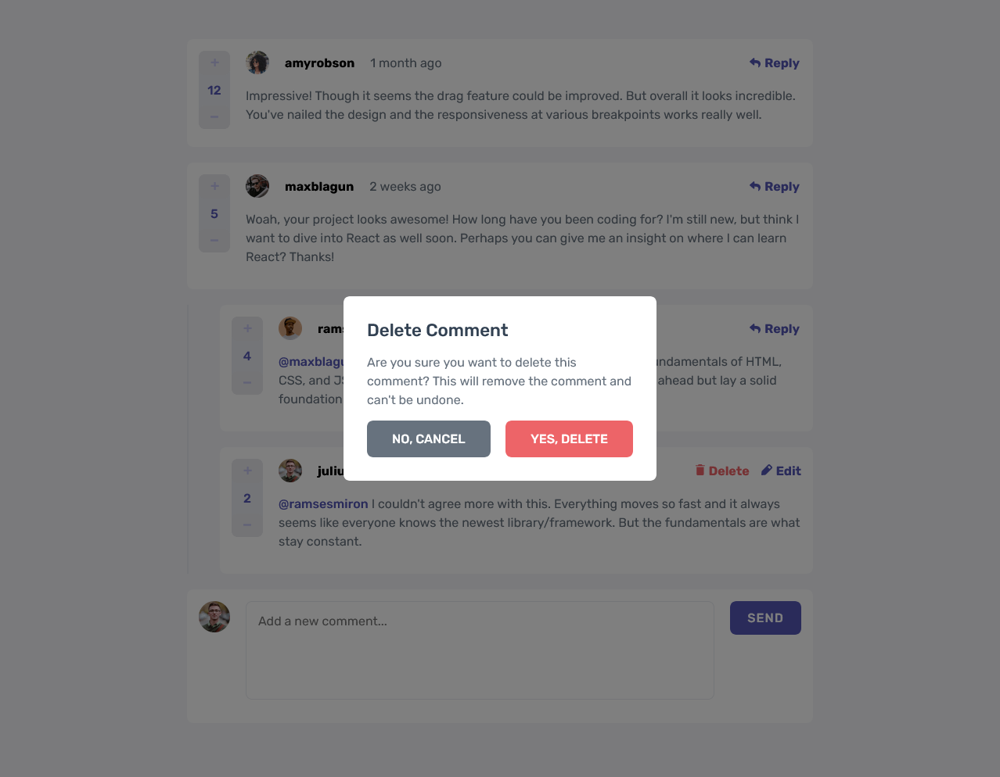
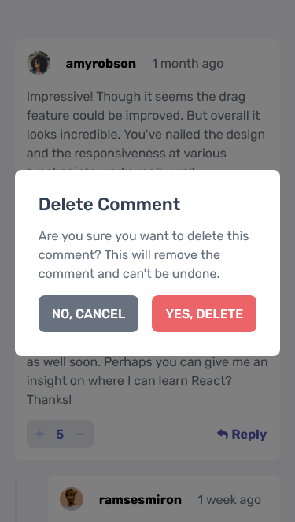

# Frontend Mentor - Interactive comments section solution

This is a solution to the [Interactive comments section challenge on Frontend Mentor](https://www.frontendmentor.io/challenges/interactive-comments-section-iG1RugEG9). Frontend Mentor challenges help you improve your coding skills by building realistic projects.

## Table of contents

- [Overview](#overview)
  - [The challenge](#the-challenge)
  - [Screenshot](#screenshot)
  - [Links](#links)
- [My process](#my-process)
  - [Built with](#built-with)
  - [What I learned](#what-i-learned)
  - [Continued development](#continued-development)
  - [Useful resources](#useful-resources)
- [Author](#author)

## Overview

### The challenge

Users should be able to:

- View the optimal layout for the app depending on their device's screen size
- See hover states for all interactive elements on the page
- Create, Read, Update, and Delete comments and replies
- Upvote and downvote comments
- **Bonus**: If you're building a purely front-end project, use `localStorage` to save the current state in the browser that persists when the browser is refreshed.
- **Bonus**: Instead of using the `createdAt` strings from the `data.json` file, try using timestamps and dynamically track the time since the comment or reply was posted.

### Screenshot

### Links

- Solution URL: [GitHub Repo](https://github.com/CallMe-AL/fementor-interactive-comments/tree/main)
- Live Site URL: [Live site on GitHub](https://callme-al.github.io/fementor-interactive-comments/)

## My process

### Built with

- [React](https://reactjs.org/) - JS library
- CSS custom properties
- Flexbox
- Mobile-first workflow

### What I learned

Good refresher for React! Learned how to use the "process.env.PUBLIC_URL" to dynamically add images, as well as about changes to React v18. Additionally learned how to play around with currentuser status when dealing with datasets. I also learned more about how to use textarea inputs, and focus on them when a user clicks on the input area. Finally, I learned how to calculate how long it's been since the creation of a certain element based on various data from the Date object.

### Continued development

I'd like to find ways to make my React code more concise. I'm happy with how the project turned out, but I feel I could have completed it with far less code. Perhaps better planning ahead could solve this so I make less components, or better control which components control which states so I pass state around less often. I'd additionally like to recreate a project like this using a backend server to really dig into saving object statuses aside from using localstorage.

### Useful resources

- [Using the public folder in React](https://create-react-app.dev/docs/using-the-public-folder/) - This helped me learn about how to dynamically reference images in React. The guide helped me learn about many other React things, too.
- [About textarea](https://developer.mozilla.org/en-US/docs/Web/HTML/Element/textarea) - The always helpful Mozilla coming in clutch to help me learn about how to use textarea inputs more efficiently.
- [About the createRoot function](https://dev.to/fromaline/reactdomcreateroot-reactdomrender-1jg6) - Useful info about one of the key v18 changes to React: ReactDOM.createRoot.

## Author

- Website - [My portfolio](https://callme-al.github.io/portfolio/)
- Frontend Mentor - [@CallMe-Al](https://www.frontendmentor.io/profile/CallMe-AL)
